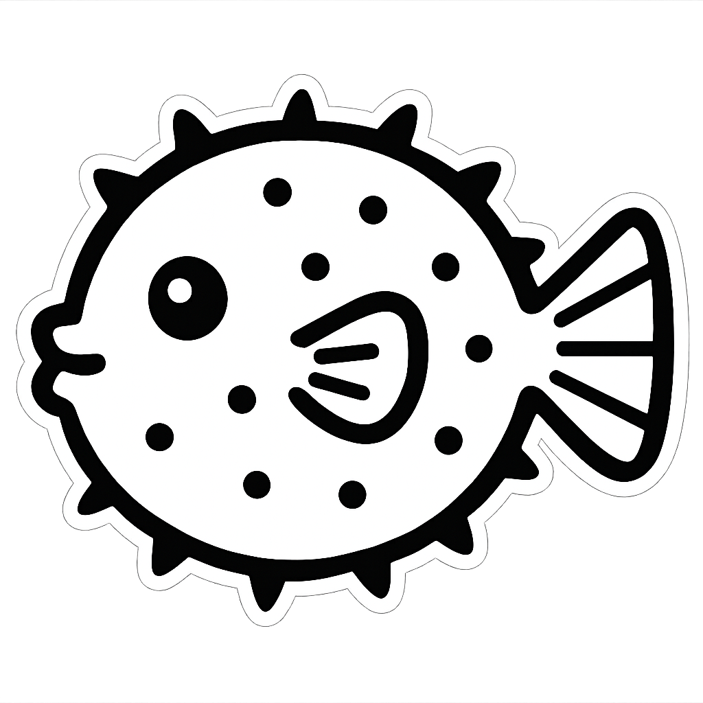

  

<h2 align="center"><a href="https://github.com/pufferfish-io" style="font-weight:900">PUFFERFISH</a> архитектура, созданная для масштабирования</h2>

## 🔗 GitHub pet-проект

> 
>
> [**Pufferfish на GitHub**](https://github.com/pufferfish-io) — pet-проект с открытым кодом, где можно посмотреть исходники и релизы.

# 🤖 Боты

- [Telegram Bot](https://t.me/pufferfish_io_bot)
- [VK Bot](https://vk.com/pufferfishio)

## 🎯 Цель проекта

- Наглядно показать современный подход к микросервисам, которые выдерживают высокую нагрузку и остаются управляемыми.
- Продемонстрировать, как разделять ответственность между командами, сохраняя единые процессы разработки, тестирования и релиза.
- Показать, как архитектура на Kafka + gRPC упрощает масштабирование, когда число пользователей и сообщений быстро растёт.
- Дать понятный blueprint для компаний, которым нужно быстро подключать новые каналы общения и обогащать ответы.

## 🧰 Используемые технологии

- **Go** — единый язык для всех сервисов, строгие линтеры, модульность.
- **Apache Kafka** — «магистраль» данных между компонентами.
- **gRPC / HTTP** — быстрые внутренние вызовы и привычные веб-интерфейсы.
- **MinIO (S3)** — хранение оригинальных файлов и медиаданных.
- **Yandex Vision OCR** (через doc2text) — распознавание текста с возможностью смены провайдера.
- **Keycloak / OIDC** — единый слой авторизации (JWT для doc2text и внешних клиентов).
- **Docker + GitLab CI/CD + GitHub Actions** — воспроизводимые сборки, автотесты и релизы.
- **Kubernetes на Linux** — целевая среда исполнения, инфраструктура в репозитории `deploy`.

## 🖥️ Используемые машины

| Контрольная плоскость |                     |
| --------------------- | ------------------- |
| ОС                    | Debian 12           |
| CPU                   | Intel Atom x5-Z8350 |
| RAM                   | 4 ГБ                |
| Диск                  | 58 ГБ eMMC          |

| Рабочий узел |                       |
| ------------ | --------------------- |
| ОС           | Debian 12             |
| CPU          | Intel Core2 Duo E8400 |
| RAM          | 4 ГБ                  |
| Диск         | 224 ГБ SSD            |

## 💡 Предназначение проекта

Платформа автоматически обрабатывает сообщения из Telegram и VK. Она проверяет, есть ли вложения, принимает изображения, запускает распознавание текста и возвращает пользователю человеческий ответ. Вся цепочка — `forwarder → normalizer → message-responder → message-responder-ocr → doc2text → response-preparer → sender` — позволяет обрабатывать тысячи запросов в минуту, подключать новые каналы и быстро заменять компоненты.

| Компонент                                                                                 | Описание                                                  |
| ----------------------------------------------------------------------------------------- | --------------------------------------------------------- |
| [deploy](https://github.com/pufferfish-io/deploy)                                         | CI/CD, Kubernetes-манифесты, инфраструктура.              |
| [doc2text](https://github.com/pufferfish-io/doc2text)                                     | gRPC‑сервис для распознавания текста через Yandex Vision. |
| [message-responder](https://github.com/pufferfish-io/message-responder)                   | Решение сценария и подготовка ответов.                    |
| [message-responder-ocr](https://github.com/pufferfish-io/message-responder-ocr)           | Проксирование запросов в doc2text.                        |
| [telegram-forwarder](https://github.com/pufferfish-io/telegram-forwarder)                 | Webhook-приёмник Telegram.                                |
| [telegram-normalizer](https://github.com/pufferfish-io/telegram-normalizer)               | Нормализация Telegram-сообщений.                          |
| [telegram-response-preparer](https://github.com/pufferfish-io/telegram-response-preparer) | Подготовка ответов для Telegram.                          |
| [telegram-sender](https://github.com/pufferfish-io/telegram-sender)                       | Сервис отправки сообщений в Telegram.                     |
| [vk-forwarder](https://github.com/pufferfish-io/vk-forwarder)                             | Webhook-приёмник ВКонтакте.                               |
| [vk-normalizer](https://github.com/pufferfish-io/vk-normalizer)                           | Нормализация событий ВКонтакте.                           |
| [vk-response-preparer](https://github.com/pufferfish-io/vk-response-preparer)             | Подготовка ответов для ВКонтакте.                         |
| [vk-sender](https://github.com/pufferfish-io/vk-sender)                                   | Отправка сообщений во ВКонтакте.                          |

## ⚙️ Технические подробности работы

1. **Webhook-слой** (telegram-forwarder, vk-forwarder) принимает запросы от мессенджеров и публикует сырые payload’ы в Kafka. Логика минимальна, чтобы легко масштабировать вход.
2. **Нормализаторы** (telegram-normalizer, vk-normalizer) скачивают вложения, загружают их в S3 и подготавливают единый JSON с метаданными и ссылками.
3. **message-responder** анализирует сообщение: если есть изображение — мгновенно уведомляет клиента, кладёт заявку в топик OCR и продолжает слушать поток.
4. **message-responder-ocr + doc2text** обмениваются по gRPC. doc2text скачивает файл из S3, конвертирует в Base64, отправляет в Yandex Vision, получает текст и возвращает его по gRPC назад.
5. **response-preparer + sender** настраивают ответ под конкретный канал (Telegram/VK), формируют запросы к API и доставляют результат пользователю. Все сервисы логируют действия, используют единые ENV-префиксы и развертываются через CI/CD.

 
 

| Автор Pufferfish                                                                                                                                                                                        |
| ------------------------------------------------------------------------------------------------------------------------------------------------------------------------------------------------------- |
|  [+7 926 395‑88‑97](tel:+7 926 395‑88‑97) [alibekov.dev@gmail.com](mailto:alibekov.dev@gmail.com) [Telegram@alibekov_dev](https://t.me/alibekov_dev) [Резюме на  hh.ru](https://hh.ru/resume/7ca1d8ecff0fad4d7d0039ed1f3339686c6d38) |
