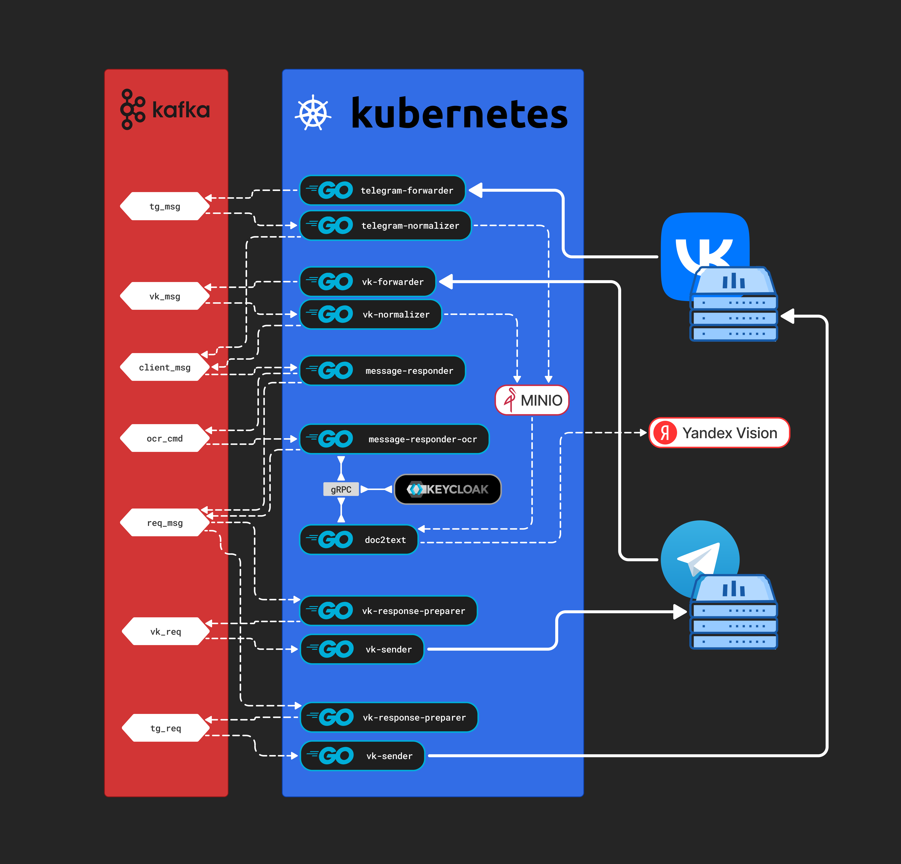

# pufferfish-io

Репозиторий **deploy** используется для CI/CD — публикации всех сервисов, настройки Kubernetes, Ingress и прочих компонентов инфраструктуры.

---

## Назначение проекта

Проект предназначен для обработки сообщений клиентов и формирования ответов.  
Текущий функционал отвечает за получение изображений и извлечение из них текста.

В дальнейшем планируется также обрабатывать **аудиозаписи пользователей**, преобразуя их в текст.

---

## Основные цели проекта

1. Создать механизм, который максимально просто масштабируется.
2. Обеспечить готовность к любым непредвиденным нагрузкам.
3. Построить архитектуру, в которой логику легко изменять и заменять реализации.

---

## Архитектура и этапы обработки сообщений

Проект разделён на несколько независимых этапов, чтобы каждый шаг обработки сообщений был максимально изолирован и устойчив к нагрузкам.

---

### 1. Получение сообщения от мессенджера

#### СЕРВИСЫ: telegram-forwarder | vk-forwarder

Микросервис получает сообщение **в исходном виде** от мессенджера.  
Я специально отказался от парсинга на этом этапе, потому что при большом потоке сообщений сервер может быть перегружен.  
Возможность горизонтального масштабирования (запуск дополнительных экземпляров) решает эту проблему, поэтому здесь важно сохранить этап максимально простым и быстрым.

Это правило едино для всех типов клиентов — сейчас это **сообщества ВКонтакте** и **Telegram**, но в будущем могут быть добавлены **WhatsApp** или даже **веб-чат на сайте**.

---

### 2. Обработка сообщения с мессенджера

#### СЕРВИСЫ: telegram-normalizer | vk-normalizer

Цель этого этапа — **преобразовать сообщение клиента в единый формат** и определить зависимости (например, прикреплённые файлы).

Изначально планировалось разделить обработчики на два типа:

- для **тяжёлых сообщений** (например, с файлами),
- для **простых** (например, только текст).

Пока это не реализовано, но в будущем планируется.  
Файлы хранятся в **полноценном файловом хранилище MinIO (S3-совместимом)**.  
Выделять отдельный сервис под него для pet-проекта я посчитал избыточным, но в реальном продакшене это было бы целесообразно для лучшего масштабирования и изоляции.

---

### 3.1. Сервис отправки ответов

#### СЕРВИСЫ: message-responder

Этот сервис принимает распарсенные сообщения, формирует ответ клиенту и при необходимости пересылает их другим обработчикам.  
Например, при получении изображения он сразу уведомляет клиента, что «идёт обработка», и параллельно отправляет это изображение в другой сервис, извлекающий текст.

Главная задача — **мгновенно отвечать клиенту**, чтобы у пользователя не создавалось ощущение зависания.  
Даже если основная обработка (например, извлечение текста) занимает время, клиент должен сразу видеть, что процесс идёт.

---

### 3.2. Сервис извлечения текста из изображений

#### СЕРВИСЫ: message-responder-ocr

Этот микросервис получает от предыдущего этапа изображение и извлекает из него текст.  
Так как вариантов для распознавания может быть несколько (или в будущем нужно будет поддерживать разные провайдеры), сам сервис **не реализует распознавание**, а **обращается к внешним сервисам**, например, сейчас это **doc2text**.

После получения текста он формирует ответ клиенту.  
Взаимодействие между сервисами происходит по **gRPC**, что обеспечивает скорость, типизацию и удобное управление версиями API.

---

### 3.3. Сервис извлечения изображений из фото

#### СЕРВИСЫ: doc2text

Это один из ключевых сервисов, которому я уделил особое внимание с архитектурной точки зрения.  
Я попытался реализовать в нём идеи **Роберта Мартина** о **чистой архитектуре**, а также подходы ведущих backend-разработчиков.

На данный момент обработка выполняется через **Yandex Vision API**.  
Сервис получает запросы по **gRPC**, что идеально подходит для микросервисной архитектуры благодаря высокой производительности и чёткой контрактности.

---

### 4. Подготовка сообщения клиенту

#### СЕРВИСЫ: telegram-response-preparer | vk-response-preparer

На этом этапе происходит формирование ответа **для конкретного поставщика** — будь то **ВКонтакте**, **Telegram** или другой канал связи.  
Каждый тип клиента имеет собственный формат сообщений, поэтому сервис подготавливает структуру в соответствии с API платформы.

---

### 5. Отправка сообщений обратно клиенту

#### СЕРВИСЫ: telegram-sender | vk-sender

Финальный этап — отправка готового сообщения клиенту в соответствующий мессенджер.  
Система поддерживает гибкость и масштабируемость, поэтому добавление новых каналов (например, WhatsApp или веб-чат) не потребует серьёзных изменений в архитектуре.

